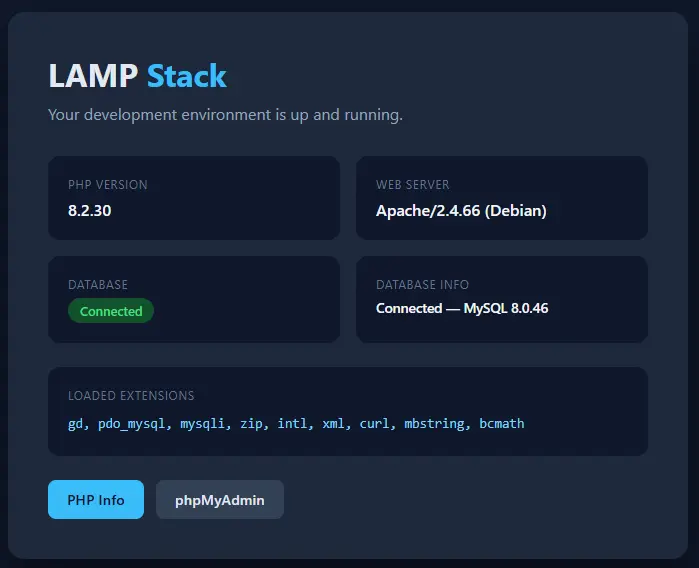

# Porting compose files to balena

### Major differences from Docker

BalenaOS is a minimal OS designed for running containers on edge devices. Our OS includes balenaEngine, which is based on Docker's Moby project and made specifically for IoT devices. As such, a few changes have been made so our container engine is more suitable for a lightweight implementation:

#### No bind mounts

Host bind mounts (`./data:/app/data`) do **not** work on balena. The host filesystem layout is managed by balenaOS and is not directly accessible to containers. Use named volumes instead.

Declare volumes in the top-level `volumes:` section and reference them in services:

```
version: "2.1"

volumes:
  app-data:
  config:

services:
  my-service:
    build: my-service
    volumes:
      - app-data:/app/data
      - config:/etc/myapp
```

Named volumes **persist across container updates** as long as the volume name stays the same, and can be shared across multiple services which allows them to access the same data. Note that volumes are purged if a device is moved to a different fleet.

Some features of the hostOS can be modified by editing the `config.txt` file. This includes udev rules, NetworkManager configuration, and much more. You can learn about all of the available options and how to edit this file in [our documentation](../../../reference/os/configuration.md).

#### dockerfile.templates

Balena's build system supports Dockerfile templates which are simply dockerfiles files named `Dockerfile.template` . Variables using the syntax `%%VARIABLE%%` in these files will undergo variable substitution before Docker processes them.

The template system exists because Docker images are architecture-specific, and balena fleets often span multiple device types (e.g., Raspberry Pi 3, Pi 4, Intel NUC) with different CPU architectures.

**Available Variables**

| Variable                  | Description                            | Example Value                          |
| ------------------------- | -------------------------------------- | -------------------------------------- |
| `%%BALENA_ARCH%%`         | Target CPU architecture                | `aarch64`, `amd64`, `armv7hf`          |
| `%%BALENA_MACHINE_NAME%%` | Yocto machine name for the device type | `raspberrypi4-64`, `genericx86-64-ext` |
| `%%BALENA_APP_NAME%%`     | Fleet name                             | `my-fleet`                             |
| `%%BALENA_RELEASE_HASH%%` | Release hash                           | `abc123...`                            |
| `%%BALENA_SERVICE_NAME%%` | Service name from docker-compose.yml   | `pihole`                               |

Note that `%BALENA_MACHINE_NAME%%` resolves to the fleet's default device type, so in mixed fleets it produces the wrong value for non-default device types. `%%BALENA_ARCH%%` is preferred because all devices in a fleet share the same architecture.

#### balena.yml

A balena.yml file is an optional configuration file for providing additional settings, defaults, and configuration for your project. It's only required if you want to publish your project to balenaHub, though it's also useful to customize a [deploy with balena button](https://docs.balena.io/learn/deploy/deploy-with-balena-button).

When present, name and type are the minimum useful fields:

```
name: "My Fleet"
type: "sw.application"
version: 1.0.0
```

Additional fields and options are [described in our docs](https://docs.balena.io/learn/deploy/deploy-with-balena-button#balena.yml-configuration-file).

#### Balena Arch vs Docker/Go Arch

Balena has its own architecture naming convention, distinct from Docker and Go:

| Balena (`%%BALENA_ARCH%%`) | Docker Platform | Go GOARCH       |
| -------------------------- | --------------- | --------------- |
| `aarch64`                  | `linux/arm64`   | `arm64`         |
| `amd64`                    | `linux/amd64`   | `amd64`         |
| `armv7hf`                  | `linux/arm/v7`  | `arm` (GOARM=7) |
| `rpi`                      | `linux/arm/v6`  | `arm` (GOARM=6) |
| `i386`                     | `linux/386`     | `386`           |

This matters because each balenaCloud fleet has a default device type and all devices in the fleet share the same architecture.

#### No .env file variables

Balena does not read `.env` files. Variables can be set through one of the following instead:

* docker-compose.yml file using the `environment` label. These values will be available in the release
* balenaCloud dashboard via the "[Device variables](https://docs.balena.io/learn/manage/variables)" tab, either per device or for the whole fleet
* the [balenaCLI](https://github.com/balena-io/balena-cli)

#### balena-specific labels and unsupported fields

Our compose-file support is currently based on version 2.4, so any fields that were introduced in version 3 are not supported. Our docs provide a list of [supported](https://docs.balena.io/reference/supervisor/docker-compose#supported-fields) and [unsupported](https://docs.balena.io/reference/supervisor/docker-compose#known-unsupported-fields) fields.

In addition, there are a list of balena-specific labels you can use in your docker-compose file to enable specific features. [The full list](https://docs.balena.io/reference/supervisor/docker-compose#labels) is in our docs.

labels are applied to a specific service with the `labels:` setting, for instance:

```
labels:
  io.balena.features.balena-socket: '1'
  io.balena.features.kernel-modules: '1'
```

### Standard workflow for conversion

When converting a Docker project to balena, use the details above and follow these steps:

1. Check `balena.yml` → what device types does this fleet target?
2. Map device types to architectures (see table above)
3. For each service: does its base image support multi-platform? If yes → plain Dockerfile. If no → Dockerfile.template with the simple `%%BALENA_ARCH%%` pattern.
4. Replace bind mounts with named volumes.
5. Remove `.env` files — migrate variables to balenaCloud dashboard or CLI.
6. Add balena-specific labels only where strictly necessary — warn the user about security implications of each (see feature labels table).
7. Use selective `devices:`/`cap_add:` for hardware access. If `privileged: true` or `cap_add: [SYS_ADMIN]` is unavoidable, add a `# WARNING:` comment in the docker-compose.yml explaining why — require explicit user acknowledgment.
8. Test with `balena build --deviceType <type>` for each target.


### Using a coding agent

Coding agents such as Claude Code and Copilot can be useful in applying the tips on this page to optimize your compose file for the balena platform. (Always inspect and test any output from an AI coding agent before placing any code in production.)

Balena's documentation includes an MCP (Model Context Protocol) server located at https://docs.balena.io/\~gitbook/mcp. AI tools can use this server to read our docs directly. This works with Claude, Claude Code, Cursor, Codex, VS Code, and other MCP clients.

#### Skill file

You can extend a coding agent's knowledge by providing it with a "skill" file. We've developed a skill file that includes all of the information in this guide (and more!) which you can find here:

[https://github.com/balena-io-experimental/skills](https://github.com/balena-io-experimental/skills)

#### Setting up your agent

Typically you place the skill file in a folder in your project's root directory. For example, for Claude in VS Code, the location would be: `.claude/skills/balenify/SKILL.md`

To use the skill, simply ask a question that matches the skill description:

`Convert this Docker project to balenaCloud`

Or simply invoke the skill using its name:

`/balenify docker-compose.yml`

### Example conversion

For our first example we'll convert a classic LAMP (Linux, Apache, MySQL, PHP) stack typically used for web development. Here's the **original Docker-compatible** docker-compose file:

```yml
services:
  php-apache:
    build:
      context: .
      dockerfile: Dockerfile
    container_name: lamp_php_apache
    restart: unless-stopped
    ports:
      - "${APACHE_PORT:-8080}:80"
    volumes:
      - ./www:/var/www/html
      - ./config/php/custom.ini:/usr/local/etc/php/conf.d/custom.ini:ro
      - ./config/apache/vhost.conf:/etc/apache2/sites-enabled/000-default.conf:ro
    environment:
      - MYSQL_HOST=mysql
      - MYSQL_PORT=3306
      - MYSQL_DATABASE=${MYSQL_DATABASE}
      - MYSQL_USER=${MYSQL_USER}
      - MYSQL_PASSWORD=${MYSQL_PASSWORD}
    depends_on:
      mysql:
        condition: service_healthy
    networks:
      - lamp_network

  mysql:
    image: mysql:8.0
    container_name: lamp_mysql
    restart: unless-stopped
    ports:
      - "${MYSQL_PORT:-3306}:3306"
    environment:
      MYSQL_ROOT_PASSWORD: ${MYSQL_ROOT_PASSWORD}
      MYSQL_DATABASE: ${MYSQL_DATABASE}
      MYSQL_USER: ${MYSQL_USER}
      MYSQL_PASSWORD: ${MYSQL_PASSWORD}
    volumes:
      - mysql_data:/var/lib/mysql
      - ./mysql/init:/docker-entrypoint-initdb.d:ro
    healthcheck:
      test: ["CMD", "mysqladmin", "ping", "-h", "localhost", "-u", "root", "-p${MYSQL_ROOT_PASSWORD}"]
      interval: 10s
      timeout: 5s
      retries: 5
      start_period: 30s
    networks:
      - lamp_network

  phpmyadmin:
    image: phpmyadmin:latest
    container_name: lamp_phpmyadmin
    restart: unless-stopped
    ports:
      - "${PMA_PORT:-8081}:80"
    environment:
      PMA_HOST: mysql
      PMA_PORT: 3306
      MYSQL_ROOT_PASSWORD: ${MYSQL_ROOT_PASSWORD}
      UPLOAD_LIMIT: 64M
    depends_on:
      mysql:
        condition: service_healthy
    networks:
      - lamp_network

volumes:
  mysql_data:
    driver: local

networks:
  lamp_network:
    driver: bridge
```

Based on the advice above, we can spot the following:

* Bind mounts need to be eliminated
* variables from .ENV files need to be hard-coded (for example `${MYSQL_DATABASE}`)
* `container_name` and `healthcheck` labels are unsupported
* `depends_on` condition only supports `service_started`&#x20;
* A compose version should be specified and adhere to v. 2.1-2.4

Our "balenify" skill goes even deeper and references a set of "best practices" that include:

* Remove MySQL external port so MySQL is internal-only; no need to expose it to the host
* Pin images to a version rather than "latest" as with the phpmyadmin service
* add a custom internal network for inter-service communication to limit blast radius

After conversion, our **balena-optimized** docker-compose file looks like this:

```yml
version: "2.1"

services:
  php-apache:
    build:
      context: .
      dockerfile: Dockerfile
    restart: always
    ports:
      - "80:80"
    environment:
      MYSQL_HOST: mysql
      MYSQL_PORT: 3306
      ##MYSQL_DATABASE: SET_VALUE_IN_DASHBOARD
      ##MYSQL_USER: SET_VALUE_IN_DASHBOARD
      ##MYSQL_PASSWORD: SET_VALUE_IN_DASHBOARD
    depends_on:
      - mysql
    networks:
      - default
      - db_internal

  mysql:
    build:
      context: mysql
      dockerfile: Dockerfile
    restart: always
    environment:
      ##MYSQL_ROOT_PASSWORD: SET_VALUE_IN_DASHBOARD
      MYSQL_DATABASE: my_db_name
      ##MYSQL_USER: SET_VALUE_IN_DASHBOARD
      ##MYSQL_PASSWORD: SET_VALUE_IN_DASHBOARD
    volumes:
      - mysql_data:/var/lib/mysql
    networks:
      - db_internal

  phpmyadmin:
    image: phpmyadmin:5.2.2
    restart: always
    ports:
      - "8081:80"
    environment:
      PMA_HOST: mysql
      PMA_PORT: 3306
      ##MYSQL_ROOT_PASSWORD: SET_VALUE_IN_DASHBOARD
      UPLOAD_LIMIT: 64M
    depends_on:
      - mysql
    networks:
      - default
      - db_internal

volumes:
  mysql_data:

networks:
  db_internal:
    driver: bridge
    internal: true
```

Note that some of the environment variable lines have been commented out. These values should be  set using the [variable feature of the balenaCloud dashboard](https://docs.balena.io/learn/manage/variables).

You can find the full repository here. Pushing this code to your balena device and then browsing to its local IP address should yield the following page:

<figure><figcaption></figcaption></figure>
