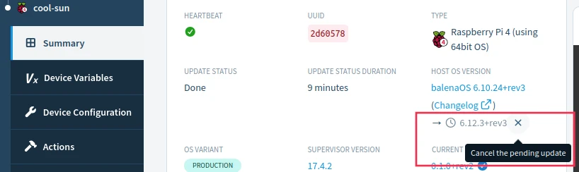

# Self-service updates

We periodically release updates and improvements to balenaOS (the host OS running on all balena devices), and we encourage you to keep your devices up to date. Below we first describe generally how updates are queued for deployment, and then show the steps to perform an update via the dashboard.


Queued updates with retries are active as of Q3 2026. Historically updates required a device to be currently connected to Cloudlink, and did not provide retries.


## Queued updates

OS updates are queued to run asynchronously in a two step process, similar to pinning an application update.

* Select devices and OS version for update, which queues the request
* Supervisor on device retrieves the queued request and runs the update


Supervisor v19 adds the ability to retrieve the update request from the device. For older Supervisors, balenaCloud retrieves the queued request when a device is Online and pushes it to the device.


The first step in a host OS update is to select the devices within a fleet, as described in detail below. This request sets the contents of each device record in balenaCloud with the selected OS version, which queues the update.

The timing for Supervisor retrieval of the request depends on a device's [connectivity state](https://docs.balena.io/learn/manage/device-statuses#device-connectivity-states):

* Online or Cloudlink-only connected devices quickly receive notification from balenaCloud
* API heartbeat-only connected devices retrieve the request on the Supervisor's next poll of balenaCloud for updates, typically on a 15 minute interval
* Offline devices don't update until they reconnect to balenaCloud; however the update request remains in the queue

Finally, the Supervisor installs the update from the balenaCloud image registry and reboots the device into the new OS version. If the update fails, the Supervisor retries it [as detailed below](self-service.md#failure-retries-and-cancellation).


You also can queue devices for an OS update via the CLI, SDKs or API.


## Device and version selection

To run an update for an individual device, navigate to that device's _Settings_ tab, go to the section _OS version_, and select the version of balenaOS you would like to update to. After making your selection, click the _Save_ button.

<figure><figcaption></figcaption></figure>

Updates can also be made to multiple devices in the same fleet. From the device list, click the checkbox to the left of any devices you wish to update. Then use the _Modify_ dropdown to choose the _OS version_ option to set and trigger an update on all selected devices.

<figure><figcaption></figcaption></figure>

From the dialog box that opens, select the desired OS version and click the `Update` button to queue the update.

<figure><figcaption></figcaption></figure>


Updates to the balena Supervisor, balena's agent on the device, can be [triggered independently](../../supervisor/supervisor-upgrades.md).


After selecting the OS version, the device summary page shows the update has been queued. The example below has queued v6.12.3+rev3.

<figure><figcaption></figcaption></figure>

## OS installation

As the Supervisor installs the OS update, the device summary page shows a progress bar that marks the steps completed for the update. The "Running..." step shown below typically takes longer since it includes time-consuming aspects of the update, like downloading and installing the new OS image. Update time can vary significantly depending on the speed of the local network, SD card (or other storage medium) performance, and device performance.

<figure><figcaption></figcaption></figure>

## Failure, retries and cancellation

The OS update process has been refined over many years to work reliably. However, a failure may occur for a variety of reasons like device incompatibility with the update, or network configuration or conditions.&#x20;

There are two classes of failures:

* During OS installation, a failure typically results in the device status on the summary page showing "OS update failed"
* While booting into the new OS, a failure results in rolling back to the old OS version (see [Rollbacks](https://docs.balena.io/reference/os/updates/rollbacks))

In either case the host OS is still queued for update. The Supervisor retries the update twice in sequence. If the update still does not complete, the Supervisor waits two days before trying again. This ongoing retry scheme is designed for failure from external or transient conditions that may improve, allowing the update to eventually succeed.


For Supervisors < v19, without the ability to retrieve the OS update, balenaCloud retries once when a device reconnects with Cloudlink.


However, sometimes the failure requires some intervention, and it is best to stop retries. In this case, you may cancel the update by clicking the button that appears beside the target OS version when hovering over it, like the screenshot below. The queued version then should be cleared from the display.

<figure><figcaption></figcaption></figure>

Alternatively, you can cancel the queued update using any of the version selection options described above, by re-selecting the current OS version.&#x20;

#### Troubleshooting

BalenaOS writes a log on the device devoted to the OS update at `/mnt/data/balenahup/` (or the legacy location `/mnt/data/resinhup/`). If the cause of the failure or its resolution still is unclear, contact us via support or the [troubleshooting section of the forums](https://forums.balena.io/c/troubleshooting).

## Update locks

[Update locks](https://github.com/balena-io/docs/blob/main/pages/external-docs/update-locking.md) is a mechanism that allows applications to enter critical sections of code and prevent updates that would interrupt the application from running. Update locks can also be used to delay the reboot that applies a hostOS update operation until the application exits the critical section by removing the update locks. HostOS update operations require the use of exclusive locks and will not respect shared locks. [Overriding update locks](https://github.com/balena-io/docs/blob/main/pages/external-docs/update-locking.md) will ignore existing locks and allow a hostOS update process to proceed with a reboot.

Check out our [update process](update-process.md) to understand how the process goes through each step.
